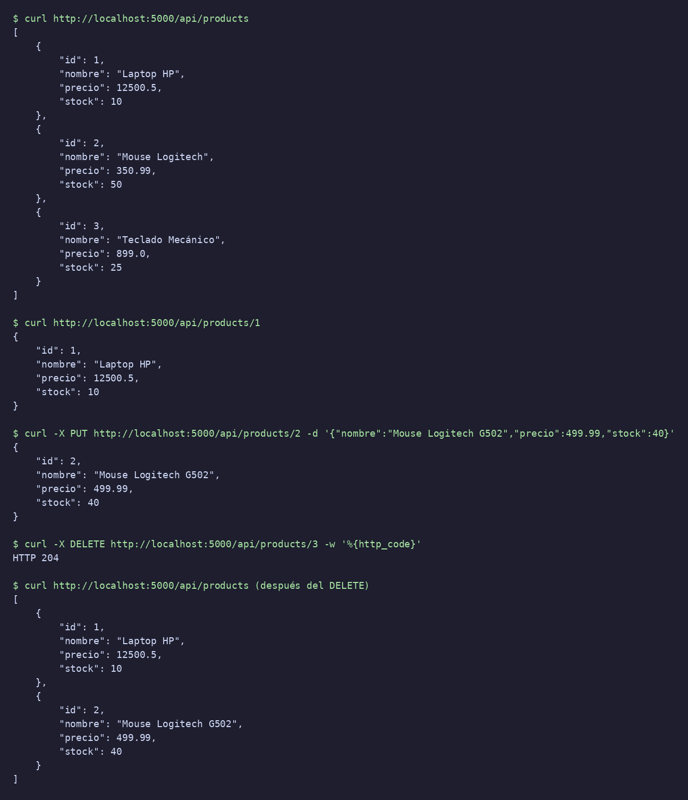

# ProductApi

## Descripción

API web para administrar los productos de una tienda. Permite ver todos los
productos, consultar uno por su ID, crear, actualizar y eliminar productos.

Cada producto tiene un Id, un Nombre, un Precio y un Stock.

## Tecnologías utilizadas

- ASP.NET Core Web API con .NET 10
- Entity Framework Core
- PostgreSQL en un contenedor de Docker

## Estructura de capas

El proyecto está organizado en capas. El Controller recibe las peticiones,
el Service contiene la lógica, el Repository accede a los datos a través de
la interfaz IProductRepository y la información se guarda en PostgreSQL.

Las carpetas del proyecto son:

- `Controllers`: recibe y responde las peticiones HTTP
- `Services`: lógica de negocio
- `Repositories`: interfaz e implementación del acceso a datos
- `Models`: la entidad Product
- `Data`: el contexto de Entity Framework

Las dependencias se registran con inyección de dependencias en `Program.cs`.

## Crear la base de datos

Con PostgreSQL corriendo en Docker ejecuté:

```
dotnet tool restore
dotnet ef database update
```

Con eso se crea la base de datos `products_db` con la tabla de productos.
La cadena de conexión está en `appsettings.json`.

## Ejecutar el proyecto

```
dotnet restore
dotnet run
```

La API queda disponible en `http://localhost:5000/api/products`.

## Captura de los endpoints funcionando



## Pregunta de reflexión

¿Qué ventaja obtiene el sistema al hacer que el Service dependa de una
interfaz (IRepository) en lugar de depender directamente de una clase
concreta de Repository?

La ventaja es que el Service solo conoce qué operaciones puede hacer, sin
saber cómo se guardan los datos. Si mañana cambio la base de datos, solo
cambio el Repository y el Service queda igual. También puedo probar el
Service con un Repository falso sin necesidad de una base de datos real.
Al final las capas quedan desacopladas y el código es más fácil de mantener
y de probar.
